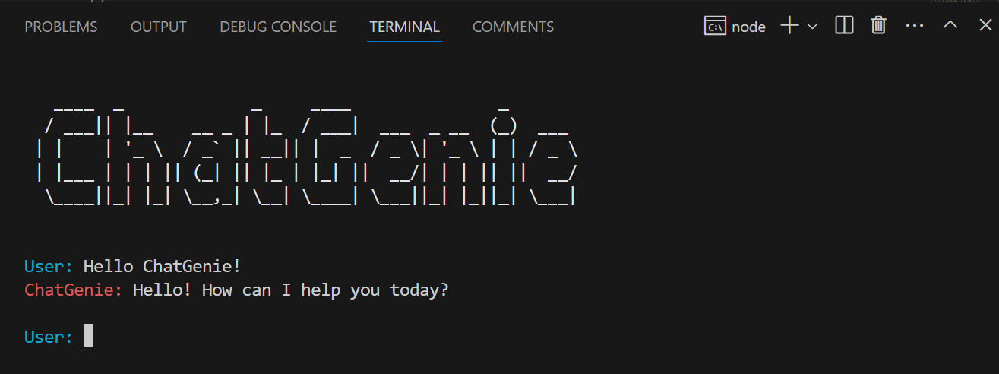

# ChatGenie - An AI Chat App


Welcome to ChatGenie! This is a terminal-based chat application that allows users to interact with an AI assistant powered by the Google Generative AI model via the Gemini Chat API.

## Description

ChatGenie is a fun and interactive terminal-based chat application where users can chat with an AI assistant powered by the Google Generative AI model through the Gemini Chat API. With its simple and playful design, ChatGenie makes it enjoyable to engage in AI-driven conversations right from your terminal.


## Requirements

Before running ChatGenie, make sure you have the following installed:

- [Node.js](https://nodejs.org/) (v14.0.0 or higher)
- [npm](https://www.npmjs.com/) (normally comes with Node.js installation)

## Installation

To run ChatGenie locally, follow these steps:

1. Clone the repository: `git clone https://github.com/your-username/chatgenie.git`
2. Navigate to the project directory: `cd chatgenie`
3. Install dependencies: `npm install`
4. Generate an API key from Gemini:
   - Visit the Gemini website, create an account, and generate an API key and secret.
5. Configure environment variables:
   - Create a `.env` file in the root directory and add the following variable:
     ```
     GEMINI_API_KEY=your-api-key
     ```
6. Start the server: `npm start`

## Usage

Once ChatGenie is running, you can interact with the AI assistant directly in your terminal. Enter your queries, and ChatGenie will respond accordingly.

## ASCII Art

```javascript
console.log(
    chalk.whiteBright(`
   ____  _             _     ____               _       
  / ___|| |__    __ _ | |_  / ___|  ___  _ __  (_)  ___ 
 | |    | '_ \\  / _\` || __|| |  _  / _ \\| '_ \\ | | / _ \\
 | |___ | | | || (_| || |_ | |_| ||  __/| | | || ||  __/
  \\____||_| |_| \\__,_| \\__| \\____| \\___||_| |_||_| \\___|                                                          
  `)
  );
  ```
## Contact

- Name: Mehetre Yash Pritam
- GitHub: https://github.com/YashMehetre
- LinkedIn: https://www.linkedin.com/in/yash-mehetre-17b2a7232
- Email: mehetreyash12@gmail.com
